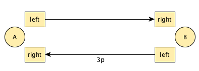
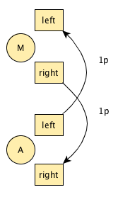
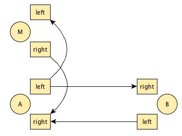
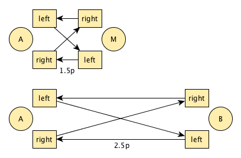

# Overlay Takeouts

## Abstract
__When jugglers come up with new club passing patterns, they seem to pick from one of the following approaches: (1) juggle more clubs, (2) introducing new ways  throwing passes and or selfs, (3) vary the number of jugglers, (4) creating routes for the passers that they go while passing, (5) introduce sequences of fixed interactions between passers and a middle-person and finally (6) creating sequences of throws by means of a theoretical approach like prechac (or TODO ref). In this dense field of ways to find new passing patterns we identified a promising gap between (4), (5) and (6). We aim at leveraging prechac theory for new interaction and route sequences in order to accomplish a truely new way of passing. First experiments already show the great variety of sequences, both for the passing part and for the middle-person part, specifically giving a great distribution over right and left hands.__

## Introduction and Basic Idea
- _prolonged version of abstract adding more references and going into more historic detail (i.e. wally-walk and such)_
- _problem statement (taken from abstract) maybe research questions (if that's not too much)_
- _one sentence solution introduction_
- _paper walk (section 1.... )_

We always liked club passing a lot, but what got us really hooked were a special group of patterns, back then known to us as "take outs". We assume the reason for the excitement was the fact, that at this time (late 1990's) these kind of patterns had been explored only to a small extent. In addition it was easy to come up with new combinations that felt different every time or gave us the impression to have entered a new "level" (starting from the existing wally-walk (citation needed) followed by the roundabout, kennedy and not to forget the so called "ass" (cite jugglerspark video)). TODO make some reference to "take that out", "get the shoe" and "pro drop". 

After a decade of "take outs" we felt, that we were missing something, the excitement has left and new variations seemed to be still the same old stuff with a new decoration. Meanwhile a new theory of generating passing patterns entered the juggling scene (actually also dating back to 1999) and got us newly excited with similar promises and actual results. Together with many other jugglers we explored prechac notation based pattern generation and came up with new and exciting patterns (see "under prechac" video). 

A couple of years later we are now still finding new and uniqe-feeling patterns but start to get to a point of saturation. Looking for new points to start off, we took a more systematic approach this time, analyzing existing techniques and trying to find gaps, combinable theory and other ways to come up with truely new passing. As pointed out in the abstract, there is already a field of techniques which jugglers can rely on when comming up with new patterns. 

More specifically we identified the following limitations in our previous work:

* Only three different versions of interactions between middle-person and passers: pre-early, early and late take-outs combined with a smash in from above or from below. 
* Only four-count based passing for the passers, interupted by the middle-person in a way that doesn't need a change of the pattern (in theory)

Consequently we choose from what we already were familiar with and tried to combine it: take out (specifically roundabout) patterns and the prechac technique of generating patterns. In this way we tried to overcome the "boring" same old take outs (citation) and replacing it with a simple prechac-generated pattern. At the same time we replace the overly present four-count based patterns with more exciting prechac patterns (preferably with right and left handed passes) as the passers base-pattern. 

In the next section we will introduce such a new pattern as an example to give a quick start to the general idea. The section is followed by an in-depth explanation of the approach. By exploring a further example in our case study, with more of the required features, we will try to bring across the advantages that we intended to get out of this new technique. The following related work section will point out other work in the field in more detail. In our discussion section we try to discuss our results from working one year on the case study and how we think that we reached what we wanted and what still remains unsolved. In the final section we give a short summary and conclude with future work.
## Motivating Example
- _start with a boring standard take out pattern (round-about) pointing out the missing ways to get to something more interesting_
- _problems: more persons: so what, more clubs: has beend done, other routes: entertainging only up to a certain point and so on_
- _motivating example: delightfull_
- _explain trick, show what's opening up here_

In our early take-out phase we were excited about the wally walk but thought it would be nicer to have exchanging roles. We came up with the so called roundabout pattern, where the middle-person is exchanging with a passer who will then become the new middle-person just to swap roles with the next one. Until now we took this base pattern in many directions: we introduced more persons (kennedy), we did it with more clubs and we tried more interesting routes with more persons. (TODO what about that 7-club tekkno thing?) But all of it basically boiles down to some existing four-count based base pattern combined with wally-walk-style take-outs.

We will now show our first attempt at leveraging the prechac notation to roundabout like patterns by a short tutorial on a pattern that was finally named delightfull. We wanted to start out with a simplistic proof of concept, so we chose to have not too many clubs for the passers (i.e. 5) and only an extra club for the middle-person. Also the passing pattern should not be too demanding so we finally went for a period 4 passing pattern: [5 clubs, period 4](http://prechacthis.org/index.php?persons=2&objects=5&lengths=4&max=3&passesmin=1&passesmax=4&jugglerdoes=&exclude=&clubdoes=&react=&results=). 
## Generating Overlay Takeouts
- _introduce the idea based on the example_
- _(1) create a prechac pattern, (2) create another siteswap that shares a non-interfering sequence (is that somehow defined?), (3) prechac the shared part and juggle both at once, (4) add some walking sequence to it_

## Case Study and Evaluation: Mission Impossible
- _What where we aiming for?_
- _Requirements: more complex than delightfull, not too demanding for participants (throws, catches, number of clubs, "familiar" elements), left right handed_
- _First approach: 1 2 3 4 2.5p and 0 1 2 1.5p overlayd to: 1 2 3 1.5p 2.5p

## Related Work
- _see following stuff that flo startet with_ 
- _add differentiation and more placement like structure_
- _emphasize what makes our approach newer_
Some references

* [Take That Out](https://vimeo.com/28502455)
* [Get The Shoe](https://www.youtube.com/watch?v=Yemkg_z7MAE)
* [Berlin Variations incl. Ass](https://www.youtube.com/watch?v=49Z7-wo_XtI)
* [Aidan Burns](http://www.geocities.ws/aidanjburns/passing.html)

Mostly 3 club cascade with [substitution, intercept and carry](http://ezine.juggle.org/2014/05/26/scrambled-passing-patterns-and-takeout-notations-part-1/)

* [Christophe Prechac's Article](https://www.passingdb.com/articles.php?id=13)
* [Gandini Prechac Patterns](http://www.owenreynolds.net/notation/Symmetric_patterns_C.pdf)
* [Social Siteswaps](https://www.youtube.com/watch?v=W_G74eLnK1U)
* [Under Prechac](http://underprechac.de)
Arbitrary Prechac Siteswap Patterns with period 3 to 7 clubs and period 2 to 6

Our idea was to rejoin these two line of development i.e. have runaround, but relax some restrictions and do some fun period 5 stuff with 4, 2p and 1 in it - there is more to life than single selves and single passes!

## Discussion, Threats to Validity 
- _Summary what we did, what we "solved"_
- _Marvel on how much we enjoyed our pattern_
- _Point out that it is not easy to actually get from a combination of patterns on paper to a real juggled pattern_
- _The small sample of patterns realized is not valid to claim that you can come up with patterns quickly and just have fun with them juggling them_
- _We have no general theory for the runaround part_
- _Nevertheless we believe in the necessity and strong creative potential of our approach, because we actually had a very good time ..._

## Conclusion and Future Work
- _We identified a gap_
- _Following the idea of combining take-outs and prechac, we came up with a new pattern generating technique_
- _Two step approach: (1) creating overlay prechacs, (2) dealing with runaround pecularities
- _Open discussion: is there a more general way of also creating the runaround part? Up to now we just "dealt with it" by try and error_

## Generating Overlay Takeouts
Let's first look at a simplistic proof of concept. This should explain the procedure while keeping the clubs low and number easy to deal with

### Step 1: Pick any two person passing pattern
In this case it should be super mellow, so let's go for [5 clubs, period 4](http://prechacthis.org/index.php?persons=2&objects=5&lengths=4&max=3&passesmin=1&passesmax=4&jugglerdoes=&exclude=&clubdoes=&react=&results=): This one looks feasible: [3p 3 1 3]("http://prechacthis.org/info.php?pattern=[p(3,1,5),p(3,0,3),p(1,0,1),p(3,0,3)]&persons=2&swap=[]&back=persons%3D2%26amp%3Bobjects%3D5%26amp%3Blengths%3D4%26amp%3Bmax%3D3%26amp%3Bpassesmin%3D1"). Let's set it up face to face with classic straight 3p from right to left:

The only restriction is that there must be one self that is higher than half the period, in this case 3 or higher. This self will be shared between passer _A_ and the manipulator. To transform it into a shared pass, we have to subtract half the period (check [Sean's](http://www.owenreynolds.net/notation/Symmetric_patterns_C.pdf) or the [wikibook's](https://en.wikibooks.org/wiki/Juggling/Symmetric_Passing_Patterns) explanation). So we turn a 3 into a 1p that that is exchanged _symmetrically_
between passer _A_ and manipulator _M_, while _A_ and _B_ share the 3p.

Be sure to be comfortable with this pattern at first.

### Step 2: Create a manipulation pattern
Now this is a little more complicated.

* It must have the same period, here 4.
* It must the pass that we created in the last step, and _only_ that pass, here 1p.
* It should not have not too many clubs, say 3.

As this can get slightly complicated, [you can ask prechacthis.org]("http://prechacthis.org/index.php?persons=2&objects=3&lengths=4&max=3&passesmin=1&passesmax=1&jugglerdoes=1p")

We gave [3 1 1p 1]("http://prechacthis.org/info.php?pattern=[p(3,0,3),p(1,0,1),p(1,1,3),p(1,0,1)]&persons=2&swap=[]&back=persons%3D2%26amp%3Bobjects%3D3%26amp%3Blengths%3D4%26amp%3Bmax%3D3%26amp%3Bpassesmin%3D1%26amp%3Bpassesmax%3D1%26amp%3Bjugglerdoes%3D1p") a try. You can arrange this pattern in different ways. One practical solution is to do it side by side with the 1p going inside to outside:

### Step 3: Overlay the two patterns
From the perspective of juggler _B_, she is just doing the passing pattern. The manipulator _M_ is just doing the mini pattern. Passer _A_, however, is doing _both at once_, i.e. 3p 3 3 1 1p. This is going to feel weird - no matter how well you master both patterns separately.

Once you can short cut the smart but slow parts of your brain this feels quite intriguing, though. As the throws are quite simple in this case, we could not resist the temptation to turn it into a roundabout right away:

<video width="640" height="360" controls preload="metadata" 
    <source src="delightful.mp4" type="video/mp4" />
</video>

  
## Initial Results
After this rather conventional experiment we went for something more exotic. We wanted a 5 club, period 5 base pattern. Let there be a 4, so we end up with a 1.5p - that should feel like a takeout's smash-in. This is what [PrechacThis offers us](http://prechacthis.org/index.php?persons=2&objects=5&lengths=5&max=4&passesmin=1&passesmax=1&jugglerdoes=&exclude=&clubdoes=1+4+or+2+4&react=&results=42).

[4 2.5p 1 2 3]("http://prechacthis.org/info.php?pattern=[p(1,0,1),p(2,0,2),p(3,0,3),p(4,0,4),p(2.5,1,5)]&persons=2&swap=[]&back=persons%3D2%26amp%3Bobjects%3D5%26amp%3Blengths%3D5%26amp%3Bmax%3D4%26amp%3Bpassesmin%3D1%26amp%3Bpassesmax%3D1%26amp%3Bjugglerdoes%3D%26amp%3Bexclude%3D%26amp%3Bclubdoes%3D1%2B4%2Bor%2B2%2B4") - this looks fun:

<video width="640" height="360" controls preload="metadata" poster="http://juggling.tv/thumb/l-0_3972.jpg">
    <source src="missionImpossible.mp4#t=40s" type="video/mp4" />
</video>					

Ok, what mini pattern could we fit in? [It must be period 5 and have a 1.5p in it](http://prechacthis.org/index.php?persons=2&objects=3&lengths=5&max=3&passesmin=1&passesmax=1&jugglerdoes=1.5p). In that list, there is [0 1 2 3 1.5p]("http://prechacthis.org/info.php?pattern=[p(0,0,0),p(1,0,1),p(2,0,2),p(3,0,3),p(1.5,1,4)]&persons=2&swap=[]&back=persons%3D2%26amp%3Bobjects%3D3%26amp%3Blengths%3D5%26amp%3Bmax%3D3%26amp%3Bpassesmin%3D1%26amp%3Bpassesmax%3D1%26amp%3Bjugglerdoes%3D1.5p"). It looks like this:

<video width="640" height="360" controls preload="metadata" poster="http://juggling.tv/thumb/l-0_3972.jpg">
    <source src="missionImpossible.mp4#t=26s" type="video/mp4" />
</video>					

So in total we end up with:

* _A_: 1 2 3 1.5p 2.5p
* _M_: 0 1 2 3 1.5p
* _B_: 1 2 3 4 2.5p

As this is period 5, one of the jugglers has to throw tram line and the other cross. This holds for both the 1.5p (smash-in) and the 2.5p ("haff"/"joe pass"/flat pass). The passers have to agree on who goes straight an who crosses the 2.5p. For the 1.5p, the manipulator can dodge the flat passes best if she smashes the 1.5p straight, while the passer doing the overlay smashes the 1.5p _cross_. Note that in contrast to conventional takeouts the passer, too, has a smash in.

We modestly ( ;-) ) call this variation Mission Impossible, not because it was difficult (give it a spin!), but because that classic movie theme is the fanciest 5 fourth song on earth, try chanting along the rhythm!

<iframe width="100%" height="450" scrolling="no" frameborder="no" src="https://w.soundcloud.com/player/?url=https%3A//api.soundcloud.com/tracks/70927998&amp;auto_play=false&amp;hide_related=false&amp;show_comments=true&amp;show_user=true&amp;show_reposts=false&amp;visual=true"></iframe>

Once you have the pattern solid you can move on the Impossible Round about.
