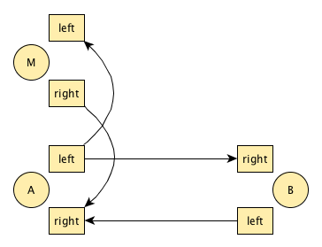
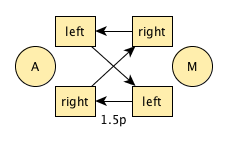
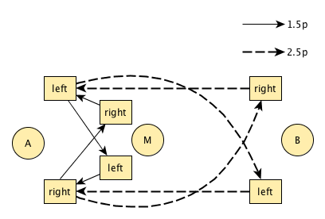

# Overlay Takeouts

## Abstract
- most known takeouts base on a simple cascade with right handed single passes
- we propose a way to base takeouts on a wide range of siteswaps

## Introduction
- _prolonged version of abstract_
- _give references to explain the historic background_
- _tell how we differ from and continue that history_
- _one sentence solution introduction_

In juggling the term "takeouts" typically refers to one or more jugglers doing a pattern while an extra juggler (manipulator or middle-person) interferes with that pattern, introducing an extra objects. This style has been known at least as far back as [Charlie Dancey's Compendium of Club Juggling](https://www.amazon.com/Charlie-Danceys-Compendium-Club-Juggling/dp/1898591148). An important impulse leading to contemporary takeouts were probably the [Take That Out performance](https://vimeo.com/28502455) and its sequel [Get The Shoe](https://www.youtube.com/watch?v=Yemkg_z7MAE). Takeout enthusiasts have generated an enormous variety of complicated and beautiful patterns, many of them collected in [Aidan Burns' famous 'How to steal from your friends'](http://www.geocities.ws/aidanjburns/passing.html). One of our favorites of this style is [Bruno's Ace](https://www.youtube.com/watch?v=49Z7-wo_XtI) - Brunos' Nightmare with two rotating manipulators.

However all these variations boil down to three club cascades with sync 4-count passes manipulated with substitutions, intercepts and carries, as [Warrens article on Scrambled Passing Patterns](http://ezine.juggle.org/2014/05/26/scrambled-passing-patterns-and-takeout-notations-part-1/) explains, some 2-, 3- and 5-counts being the exception.

Another line of developing new interactions between jugglers is based on [Christophe Prechac's article on Symmetric Passing Patterns](https://www.passingdb.com/articles.php?id=13). He essentially extended the generative power of [siteswaps](https://en.wikipedia.org/wiki/Siteswap) to the passing world. This technique has been extensively investigated and evangelized by the [Gandinis](http://www.gandinijuggling.com), leading to Sean's well known [Prechac explanation and lists](http://www.owenreynolds.net/notation/Symmetric_patterns_C.pdf) and ultimately to the epic [Social Siteswaps DVD](https://www.youtube.com/watch?v=W_G74eLnK1U). A practical tool to generate these patterns is [PrechacThis](http://prechacthis.org). A denser compilation of takeouts inspired Prechac Siteswap patterns is the [Under Prechac routine](http://underprechac.de).

Yet, that branch is focused on symmetrical patterns, i.e. every juggler is doing the same job, whereas one very intriguing aspect of takeouts is the _manipulation_, i.e. someone is doing _something to_ the pattern.

Our current idea was to rejoin these two lines of development i.e. running manipulators, but without restrictions on the patterns. More specifically, instead of only three different interactions between middle-person and passers and mostly four-count based passing, we look at period 3, 4, 5, 6 also with multiple passes, and allow "any" self (0, 1, 2, 3, 4) and pass (1p, 1.5p, 2p, 2.5p, 3p, 3.5p, 4p, 4.5p).

The technique we explored to bring these two lines together is: Take a Prechac passing pattern and _overlay_ it with a custom made manipulation siteswap.

In the next section we introduce such a new pattern as an example to give a quick start to the broad idea. The section is followed by a deeper and more general explanation of the approach. By exploring a further example, with more of the intended features, we try to bring across the advantages that we found in this new technique.

## Motivating Example
- _start with a boring standard take out pattern (round-about) pointing out the missing ways to get to something more interesting_
- _motivating example: delightfull_
- _explain trick, show what's opening up here_

One well established takeout pattern is the so called [roundabout](https://www.google.de/search?q=roundabout+juggling&tbm=vid): a 6 club 4-count with a middle-person substituting passes and selves, where the middle-person swaps roles with a passer who will then become the new middle-person and so on. Let's see how we can add Prechac siteswaps to roundabout like patterns by a short tutorial on a pattern that was accidentally named "delightful". We want to start out with a simplistic proof of concept, so we choose to have not too many clubs for the passers and only one extra club for the middle-person. Also the passing pattern should not be too demanding so let's go for a period 4 passing pattern: [5 clubs, period 4](http://prechacthis.org/index.php?persons=2&objects=5&lengths=4&max=3&passesmin=1&passesmax=4&jugglerdoes=&exclude=&clubdoes=&react=&results=). From the list that PrechacThis gives us, 
[3p 3 1 3]("http://prechacthis.org/info.php?pattern=[p(3,1,5),p(3,0,3),p(1,0,1),p(3,0,3)]&persons=2&swap=[]&back=persons%3D2%26amp%3Bobjects%3D5%26amp%3Blengths%3D4%26amp%3Bmax%3D3%26amp%3Bpassesmin%3D1") looks rather simple. Let's assume for simplicity's sake that the passers face each other and that the passes are straight, then the pattern would look like this between passers _A_ and _B_:

To add a manipulation pattern, let's start with the basic two club solo shower: 3 1 3 1. Prechac's theory tells us that we can take a one self 3 from both the passing pattern and the solo pattern and transform it into a 1p. So from the manipulator's _M_ perspective, _M_ is just passing 
[3 1 1p 1]("http://prechacthis.org/info.php?pattern=[p(3,0,3),p(1,0,1),p(1,1,3),p(1,0,1)]&persons=2&swap=[]&back=persons%3D2%26amp%3Bobjects%3D3%26amp%3Blengths%3D4%26amp%3Bmax%3D3%26amp%3Bpassesmin%3D1%26amp%3Bpassesmax%3D1%26amp%3Bjugglerdoes%3D1p") with _A_. There are different ways to set this up, let's assume side by side with the 1p going inside to outside:

When we overlay these two patterns, _B_ just hangs on to the passing pattern as above. But _A_ is doing _both at once_, i.e. 3p 3 3 1 1p:

To summarize the jobs:

* _A_: 3p 3 1 1p
* _B_: 3p 3 1 3
* _M_: 3 1 1p 1

A good way to get the pattern started is to let _A_ have two clubs in the right start with the right in 3p 3 1 1p, zipping the 1 into a wrong end catch. _B_ and _M_ can react intuitively.

TODO Videolink static delightful

A runaround can be achived as easily as in the classic roundabout by letting swapping roles and walking to the other side of the pattern:

TODO Videolink runaround delightful

## The General Principle
- _summarize the idea based on the example_
- _(1) take/create a prechac pattern, that has one self > 1+period/2_
- _(2) create solo siteswap of the same period containing that self -> but transform the self into a pass_
- _(3) juggle both at once_
- _(4) add some walking sequence to it_
- _take material from here:_ https://github.com/prechac/prechacthis/blob/a5bfcf09f936b70f18f1a9309e8a2ed3765d73da/2016-11-overlay-takeouts.md

## Fully fledged example Mission Impossible
- _What where we aiming for?/Requirements:_ 
    - _not too demanding for participants (throws, catches, number of clubs, "familiar" elements)_
    - _left right handed, i.e. odd period_
    - _possibility to correct a wrong handed 1.5p, e.g. club does 1 1.5p_
- _First approach: 1 2 3 4 2.5p and 0 1 2 1.5p overlayed to: 1 2 3 1.5p 2.5p_

Now that we established the general approach, consider a pattern that incorporates more of the elements that aimed for in the first place:

* It should left-right-handed, hence period 5.
* There should be a 1 1.5p, i.e. a "smash-in" preceded by a grip-correcting 1
* Not too difficult for the passers, i.e. 5 clubs, just one low pass.

This is what [PrechacThis offers us](http://prechacthis.org/index.php?persons=2&objects=5&lengths=5&max=4&passesmin=1&passesmax=1&jugglerdoes=&exclude=&clubdoes=1+4+or+2+4&react=&results=42).

Our first attempt is [4 2.5p 1 2 3]("http://prechacthis.org/info.php?pattern=[p(1,0,1),p(2,0,2),p(3,0,3),p(4,0,4),p(2.5,1,5)]&persons=2&swap=[]&back=persons%3D2%26amp%3Bobjects%3D5%26amp%3Blengths%3D5%26amp%3Bmax%3D4%26amp%3Bpassesmin%3D1%26amp%3Bpassesmax%3D1%26amp%3Bjugglerdoes%3D%26amp%3Bexclude%3D%26amp%3Bclubdoes%3D1%2B4%2Bor%2B2%2B4"). As always in odd-period patterns, one passer goes straight and one goes cross on the 2.5p, which here is a floaty flat (aka "zap" or "joe pass").

[//]: # (<video width="640" height="360" controls preload="metadata" poster="42.5p123.png">
  <source src="missionImpossible.mp4#t=40s" type="video/mp4" />
</video>)                                       

The next step is to construct a manipulation pattern. [It must be period 5 and have a 1.5p in it](http://prechacthis.org/index.php?persons=2&objects=3&lengths=5&max=3&passesmin=1&passesmax=1&jugglerdoes=1.5p). In that list, there is [0 1 2 3 1.5p]("http://prechacthis.org/info.php?pattern=[p(0,0,0),p(1,0,1),p(2,0,2),p(3,0,3),p(1.5,1,4)]&persons=2&swap=[]&back=persons%3D2%26amp%3Bobjects%3D3%26amp%3Blengths%3D5%26amp%3Bmax%3D3%26amp%3Bpassesmin%3D1%26amp%3Bpassesmax%3D1%26amp%3Bjugglerdoes%3D1.5p"). It looks like this, again, with one passer going straight, one cross:

[//]: # (<video width="640" height="360" controls preload="metadata" poster="">
  <source src="missionImpossible.mp4#t=26s" type="video/mp4" />
</video>)                                       

When we overlay the two patterns, we end up with:

* _A_: 1 2 3 1.5p 2.5p
* _M_: 0 1 2 3 1.5p
* _B_: 1 2 3 4 2.5p

The passers have to agree on who goes straight an who crosses the 2.5p. For the 1.5p, the manipulator can dodge the flat passes best if she smashes the 1.5p straight, while the passer doing the overlay smashes the 1.5p _cross_. Note that in contrast to conventional takeouts the passer, too, has a smash-in.

We call this combination Mission Impossible, partly because it was surprisingly difficult to get your head around the overlay part (_A_), partly out of reverence for Lalo Shifrin's famous movie theme - one of the few widely known five fourth songs. Try chanting along the rhythm!

<iframe width="100%" height="450" scrolling="no" frameborder="no" src="https://w.soundcloud.com/player/?url=https%3A//api.soundcloud.com/tracks/70927998&amp;auto_play=false&amp;hide_related=false&amp;show_comments=true&amp;show_user=true&amp;show_reposts=false&amp;visual=true"></iframe>

TODO elaborate: Once you have the pattern solid you can move on the Impossible Round about. Matter of a second article.

## Observations, Discussion
- _Point out that it is, at first, surprisingly hard to juggle the overlay, even though on masters both partial patterns_
- Yes, the passer cannot ignore the manipulator, but that is true for most takeouts ("pelf")
- _Once you by pass the your thinking machinery, its actually not that hard, you become part of a clock work, which is what the whole takeout business is about_
- _Two step approach: (1) creating overlay prechacs, (2) dealing with runaround pecularities_

## Future Work
- _Describe the run around part of Mission Impossible in more detail (transition, starts, permutations)_
- _let's see how many interesting patterns can be generated that way_
- _mamupulate why not, not why etc.
- _See how Aidan's and Ed's notation can help to find a theory for the runaround part_